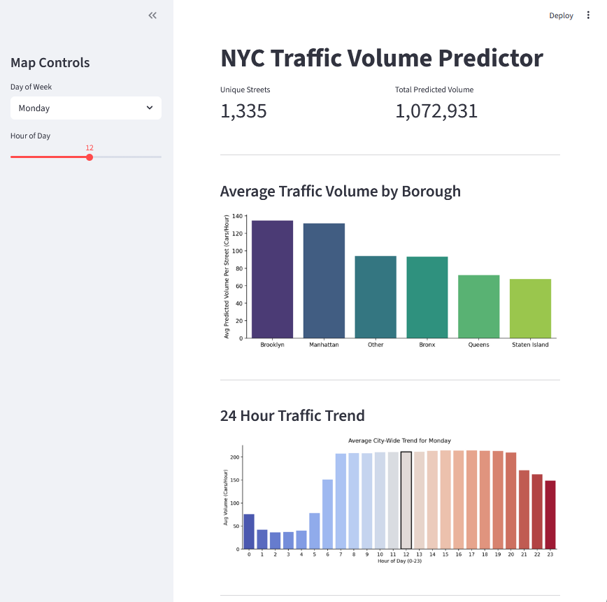
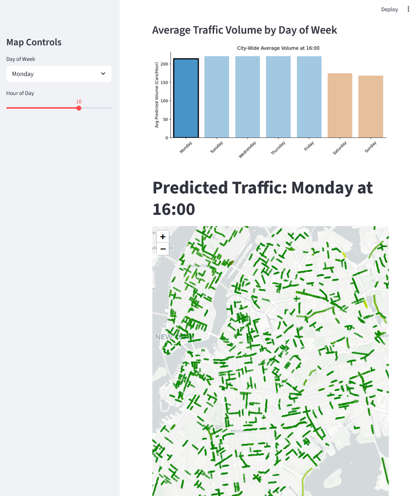

# NYC Traffic Volume Predictor

An end-to-end data pipeline and interactive Streamlit dashboard that predicts
hourly traffic volume across New York City street segments.

## Project Overview

**API used:** [NYC DOT Traffic Volume Counts — NYC Open Data (Socrata)](https://data.cityofnewyork.us/resource/7ym2-wayt)

The project pulls public traffic-count records from the NYC Open Data Socrata
API (no API key required), runs a full ETL pipeline into a local SQLite
database, trains a Random Forest model on the cleaned data, and serves an
interactive map and charts through a Streamlit dashboard.

### Pipeline stages

| Script | Role |
|---|---|
| `extract.py` | Paginates the SODA2 CSV endpoint and caches the raw CSV locally |
| `transform.py` | Cleans, normalises, and builds aggregated hourly volume tables |
| `load.py` | Writes the transformed data into SQLite atomically |
| `streamlit_app.py` | Loads the DB, trains the model, and renders the dashboard |

---

## Running with Docker

> **Prerequisites:** [Docker Desktop](https://www.docker.com/products/docker-desktop/) installed and running.

```bash
# 1. Clone the repository
git clone <your-repo-url>
cd <repo-name>/docker_pipeline

# 2. (Optional) copy the env sample and adjust any settings
#    No credentials are required — the Socrata API is fully public.
cp .env.sample .env

# 3. Build images and start all services
docker-compose up --build
```

`docker-compose up --build` will automatically:

1. Build the Docker image from `python:3.11-slim`
2. Run the full ETL pipeline (`extract → transform → load`)
3. Launch the Streamlit dashboard once the pipeline finishes

No manual setup steps are required.

> **Note:** The first run downloads the full NYC traffic dataset and the OSM road
> network, which can take several minutes. Subsequent runs use the local cache
> and start in seconds.

To stop all services:

```bash
docker compose down
```

---

## Accessing the Dashboard

Once the containers are running, open your browser at:

**http://localhost:8501**

Use the sidebar controls to select a day of the week and hour of day. The map
and charts update instantly to show predicted traffic volumes across NYC.

---

## Dashboard Screenshots




---

## Repository Structure

```
docker_pipeline/
├── streamlit_app.py      # Streamlit dashboard + ML model
├── pipeline_runner.py    # Orchestrates the ETL run
├── extract.py            # Data extraction (Socrata API)
├── transform.py          # Data cleaning and transformation
├── load.py               # SQLite load (atomic write)
├── config.py             # Paths, constants, feature column lists
├── requirements.txt      # Python dependencies
├── .env.sample           # Environment variable template (no secrets)
├── Dockerfile            # python:3.11-slim image definition
├── docker-compose.yml    # Two-service setup: etl + traffic-app
└── .dockerignore
```

---

## Team Members & Contributions

| Name | Contributions |
|---|---|
| Coleman Donham | Streamlit Dashboard & Map Visualizations |
| Matthew Lemon | Database Schema, Extraction, & Loading |
| Prasitta Seenuvasan | Database Transformations |
| Jon Tor | Docker Configuration |
